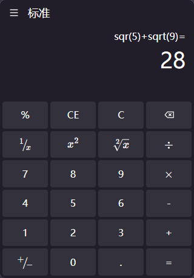

# Vue3 Scientific Calculator

A modern scientific calculator application built with Vue3 + Vite + MathJS, featuring keyboard support and complex mathematical expression evaluation.

## 🌐 Demo

https://1245040330.github.io/vite-calculator/

🌐 **[中文文档](README_CH.md)** | **[English Documentation](README.md)**

## 🧩 screenshot


## ✨ Features

- 🧮 **Basic Operations**: Support for addition, subtraction, multiplication, and division
- 🔢 **Number Input**: Support for decimal points and negative numbers
- ⌨️ **Keyboard Support**: Complete keyboard shortcut functionality
- 🎨 **Mathematical Notation**: Professional mathematical symbols using KaTeX rendering
- 📱 **Responsive Design**: Mobile and desktop compatibility
- 🧠 **Smart Calculation**: Integrated MathJS for complex mathematical expressions
- ⚡ **Fast Performance**: Built with Vue3 and Vite for optimal speed

## 🚀 Tech Stack

- **Frontend Framework**: Vue 3 (Composition API)
- **Build Tool**: Vite
- **Mathematical Computation**: MathJS
- **Mathematical Notation Rendering**: KaTeX
- **Mobile UI**: Vant
- **Keyboard Events**: @vueuse/core
- **Styling**: SCSS + UnoCSS

## 📦 Project Structure

```
vite-calculator/
├── src/
│   ├── components/          # Common components
│   ├── views/
│   │   └── keyboard/        # Calculator keyboard components
│   ├── assets/              # Static assets
│   └── main.js              # Application entry point
├── public/                  # Public resources
└── package.json
```

## 🛠️ Installation & Setup

### Install Dependencies
```bash
npm install
```

### Development Environment
```bash
npm run dev
# or
npm run serve
```

### Production Build
```bash
npm run build
```

### Preview Build Result
```bash
npm run preview
```

## ⌨️ Keyboard Shortcuts

| Key | Function |
|-----|----------|
| Number Keys 0-9 | Input numbers |
| + - * / | Basic arithmetic operations |
| Enter | Calculate result |
| Backspace | Delete last character |
| C | Clear all |
| CE | Clear current entry |
| . | Decimal point |

## 🧮 Supported Mathematical Functions

- Basic operations: `1 + 2`, `3 * 4`, `10 / 2`, `8 - 3`
- Decimal operations: `3.14 + 2.5`
- Complex expressions: `2 * (3 + 4)`, `sqrt(16)`, `pow(2, 3)`

## 🔧 Core Implementation

### Mathematical Calculation
Using MathJS for safe mathematical expression evaluation:
```javascript
import { create, all } from "mathjs"
const math = create(all)

// Safe expression evaluation
const result = math.evaluate("2 + 3 * 4")
```

### Keyboard Event Handling
Using @vueuse/core for keyboard event monitoring:
```javascript
import { useMagicKeys } from '@vueuse/core'
const magicKeys = useMagicKeys()
```

### Mathematical Formula Rendering
Using KaTeX for mathematical symbol rendering:
```javascript
import katex from "katex"
const renderResult = katex.renderToString("x^{2}", { throwOnError: false })
```

## 🎨 UI Design

- **Display Screen**: Shows current input and calculation history
- **Keyboard Layout**: 6x4 grid layout with scientific calculator styling
- **Button Feedback**: Key highlighting and hover effects
- **Mathematical Symbols**: Professional mathematical notation (square, square root, etc.)

## 📱 Mobile Adaptation

- Mobile experience ensured with Vant component library
- Responsive grid layout
- Touch-friendly button design

## 🔒 Security Features

- Uses MathJS instead of eval to prevent code injection risks
- Input validation and error handling
- Safe mathematical expression parsing

## 🤝 Contributing

Feel free to submit Issues and Pull Requests to improve this project!

## 📄 License

MIT License

---

**⭐ If this project helps you, please give it a Star!**